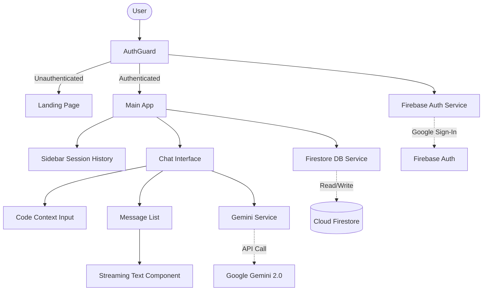

# DevBrief AI Architecture

This document outlines the high-level architecture of DevBrief AI.

## System Overview

## Component Table

| Component | Responsibility |
| :--- | :--- |
| `AuthGuard` | Wraps authenticated routes; redirects unauthenticated users to `/`. |
| `ChatInterface` | Manages the active session state, input parsing, and orchestrates Gemini API calls. |
| `Sidebar` | Displays previous sessions fetched via `dbService`. |
| `StreamingText` | Pure presentational component that sanitizes markdown and applies syntax highlighting as text streams in. |
| `Button`, `Input` | Reusable, accessible UI primitives. |

## Core Services
All services strictly return `ApiResponse<T>` to enforce consistent error handling and type narrowing at boundaries.
- `authService.ts`
- `dbService.ts`
- `geminiService.ts`
- `analyticsService.ts`
